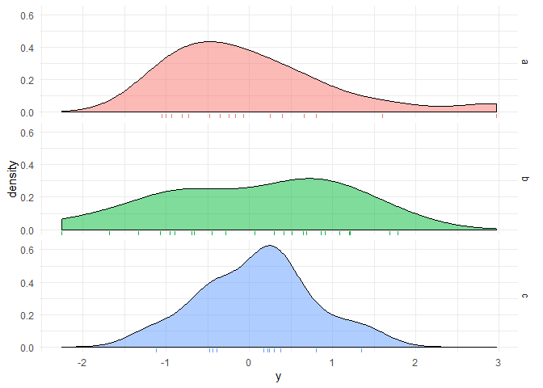

<!-- README.md is generated from README.Rmd. Please edit that file -->
This package gives a number of functions to aid common data analysis processes and reporting statistical results in an RMarkdown file. Data analysis functions combine multiple base R functions used to describe simple bivariate relationships into a single, easy to use function. Reporting functions will return character strings to report p-values, confidence intervals, and hypothesis test and regression results. Strings will be LaTeX-formatted as necessary and will knit pretty in an RMarkdown document. The package also provides a wrapper for the CreateTableOne function in the tableone package to make the results knitable.

Data analysis functions
-----------------------

Suppose we have the following data:

``` r
x = rnorm(50)
y = rnorm(50)
a = sample(letters[1:3], size=50, replace=TRUE)
b = sample(letters[4:6], size=50, replace=TRUE)
```

We can investigate the relationship betweewn `a` and `b` using `cat_compare()`:

``` r
cat_compare(y=b, x=a, title='Relationship between a and b')
```

    ## Warning in chisq.test(exclude_missing): Chi-squared approximation may be
    ## incorrect


    ## $n
    ##    a  b  c
    ## d  5  6  4
    ## e  6  6  4
    ## f  5 11  3
    ## 
    ## $p
    ##      a    b    c
    ## d 0.31 0.26 0.36
    ## e 0.38 0.26 0.36
    ## f 0.31 0.48 0.27
    ## 
    ## $chisq
    ## 
    ##  Pearson's Chi-squared test
    ## 
    ## data:  exclude_missing
    ## X-squared = 1.8516, df = 4, p-value = 0.763
    ## 
    ## 
    ## $CramersV
    ## [1] 0.1360722

We can investigate the distribution of `x` across levels of `a` using `cont_compare()`:

``` r
cont_compare(y=x, grp=a)
```

    ## $summary_stats
    ##        Min.    1st Qu.     Median       Mean   3rd Qu.     Max.
    ## a -1.046663 -0.7480237 -0.2053857 0.05322120 0.4613605 2.964352
    ## b -2.254451 -0.7907847  0.2977171 0.04822704 0.8842628 1.787713
    ## c -1.119994 -0.4130159  0.2227507 0.09457934 0.3350490 1.343516
    ## 
    ## $anova
    ##             Df Sum Sq Mean Sq F value Pr(>F)
    ## grp          2   0.02  0.0085   0.008  0.992
    ## Residuals   47  48.51  1.0320               
    ## 
    ## $eta_sq
    ## [1] 0.0003519188
    ## 
    ## $plot



`inline` and `write` functions
------------------------------

-   `inline_test()`
-   `inline_reg()`
-   `inline_coef()`
-   `inline_anova()`
-   `write_int()`
-   `write_p()`
-   `as_perc()`

Using the data above, we can obtain some inferential results:

``` r
x = rnorm(50)
y = rnorm(50)
a = sample(letters[1:3], size=50, replace=TRUE)
b = sample(letters[1:3], size=50, replace=TRUE)

test1 = t.test(x)
test2 = chisq.test(table(a,b))
model1 = lm(y ~ x)
model2 = lm(y ~ a)
```

We can then report the results of the hypothesis test inline using `inline_test(test1)` and get the following: *t*(49)=0.5, *p* = 0.62. Simiarly, `inline_test(test2)` will report the results of the chi-squared test: *χ*<sup>2</sup>(4)=2.87, *p* = 0.58. So far `inline_test` only works for *t* and chi-squared tests, but the goal is to add more functionality - requests gladly accepted.

The regression results can be reported with `inline_reg(model1)` and `inline_coef(model1, 'x')` to get *R*<sup>2</sup> = 0.01, *F*(1, 48)=0.31, *p* = 0.58 and *b* = 0.08, *t*(48)=0.56, *p* = 0.58, respectively. In addition, `inline_anova(model2)` will report the ANOVA F statistic and relevant results: *F*(2, 47)=0.11, *p* = 0.9. So far `inline_reg` and `inline_coef` currently work for `lm` and `glm` objects; `inline_anova` only works for `lm` objects.

We can also report the confidence intervals using `write_int()` with a length-2 vector of interval endpoints. For example, `write_int(c(3.04, 4.7))` and `write_int(test1$conf.int)` yield (3.04, 4.70) and (-0.22, 0.36), respecively.

P-values can be reported using `write_p()`. This function will take either a numeric value or a list-like object with an element named `p.value`. For example, `write_p(0.00002)` gives *p* &lt; 0.01 and `write_p(test1)` gives *p* = 0.62.

Many R functions produce proportions, though analysts may want to report the output as a percentage. `as_perc()` will do this. For example, `as_perc(0.01)` will produce 1%.

See the help files of all functions described above for more details and options. For example, all test and regression reporting functions have wrappers ending in `_p` which report only the p-value of the input.

`KreateTableOne`
----------------

The package also provides the function `KreateTableOne`, a wrapper for `CreateTableOne` from the `tableone` package which makes the results knitable. First use `KreateTableOne` in an R chunk with `results='hide'` (or ouside the RMarkdown document), then recall the saved data frame in a new chunk. For example:

``` r
table1 = KreateTableOne(x=mtcars, strata='am', 
                        factorVars='vs')
colnames(table1)[1:2] = c('am = 0', 'am = 1')
```

Then

``` r
knitr::kable(table1[, 1:3], align='r')
```

|                  |           am = 0|          am = 1|          p|
|------------------|----------------:|---------------:|----------:|
| n                |               19|              13|           |
| mpg (mean (SD))  |     17.15 (3.83)|    24.39 (6.17)|  &lt;0.001|
| cyl (mean (SD))  |      6.95 (1.54)|     5.08 (1.55)|      0.002|
| disp (mean (SD)) |  290.38 (110.17)|  143.53 (87.20)|  &lt;0.001|
| hp (mean (SD))   |   160.26 (53.91)|  126.85 (84.06)|      0.180|
| drat (mean (SD)) |      3.29 (0.39)|     4.05 (0.36)|  &lt;0.001|
| wt (mean (SD))   |      3.77 (0.78)|     2.41 (0.62)|  &lt;0.001|
| qsec (mean (SD)) |     18.18 (1.75)|    17.36 (1.79)|      0.206|
| vs = 1 (%)       |         7 (36.8)|        7 (53.8)|      0.556|
| am (mean (SD))   |      0.00 (0.00)|     1.00 (0.00)|  &lt;0.001|
| gear (mean (SD)) |      3.21 (0.42)|     4.38 (0.51)|  &lt;0.001|
| carb (mean (SD)) |      2.74 (1.15)|     2.92 (2.18)|      0.754|
