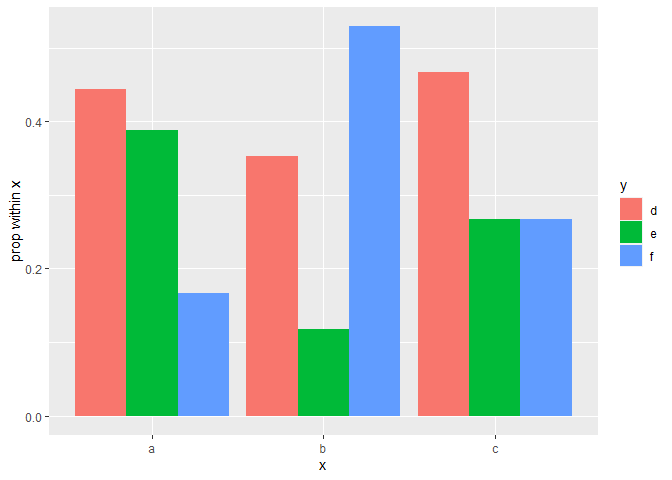
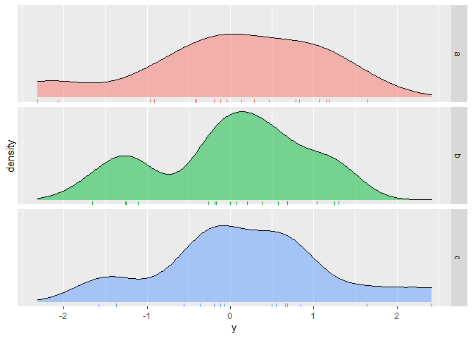

<!-- README.md is generated from README.Rmd. Please edit that file -->

This package gives a number of functions to aid common data analysis
processes and reporting statistical results in an RMarkdown file. Data
analysis functions combine multiple base R functions used to describe
simple bivariate relationships into a single, easy to use function.
Reporting functions will return character strings to report p-values,
confidence intervals, and hypothesis test and regression results.
Strings will be LaTeX-formatted as necessary and will knit pretty in an
RMarkdown document. The package also provides a wrapper for the
CreateTableOne function in the tableone package to make the results
knitable.

## Data analysis functions

Suppose we have the following data:

``` r
pred1 = sample(letters[1:3], size=50, replace=TRUE)
out1 = sample(letters[4:6], size=50, replace=TRUE)
out2 = rnorm(50)
```

We can investigate the relationship between `pred1` and `out1` using
`cat_compare()`:

``` r
cat_compare(x=pred1, y=out1)
```

    ## Warning in chisq.test(tab_no_miss): Chi-squared approximation may be incorrect

    ## $counts
    ##      y
    ## x      d  e  f Sum
    ##   a    8  7  3  18
    ##   b    6  2  9  17
    ##   c    7  4  4  15
    ##   Sum 21 13 16  50
    ## 
    ## $chisq
    ## 
    ##  Pearson's Chi-squared test
    ## 
    ## data:  tab_no_miss
    ## X-squared = 6.5486, df = 4, p-value = 0.1618
    ## 
    ## 
    ## $CramersV
    ## [1] 0.2559017
    ## 
    ## $plot

<!-- -->

We can investigate the distribution of `out2` across levels of `pred1`
using `num_compare()`:

``` r
num_compare(y=out2, grp=pred1)
```

    ## $summary_stats
    ##    n obs mis        mean     stdev         med         q1        q3
    ## a 18  18   0 0.006755781 1.0851542  0.04793630 -0.4201223 0.8188215
    ## b 17  17   0 0.001604250 0.8911016  0.07865256 -0.2591153 0.5775767
    ## c 15  15   0 0.198539217 1.0332958 -0.07142822 -0.2773362 0.6744763
    ## 
    ## $decomp
    ## Call:
    ##    aov(formula = y ~ grp, data = mydat)
    ## 
    ## Terms:
    ##                      grp Residuals
    ## Sum of Squares   0.39657  47.67131
    ## Deg. of Freedom        2        47
    ## 
    ## Residual standard error: 1.007116
    ## Estimated effects may be unbalanced
    ## 
    ## $eta_sq
    ## [1] 0.008250299
    ## 
    ## $plot

<!-- -->

## `inline` and `write` functions

  - `inline_test()`
  - `inline_reg()`
  - `inline_coef()`
  - `inline_anova()`
  - `write_int()`
  - `write_p()`
  - `as_perc()`

Using the data above, we can obtain some inferential results:

``` r
x = rnorm(50)
y = rnorm(50)
a = sample(letters[1:3], size=50, replace=TRUE)
b = sample(letters[1:3], size=50, replace=TRUE)

test1 = t.test(x)
test2 = chisq.test(table(a,b))
model1 = lm(y ~ x)
model2 = lm(y ~ a)
```

We can then report the results of the hypothesis test inline using
`inline_test(test1)` and get the following: \(t(49) = -0.7\),
\(p = 0.49\). Simiarly, `inline_test(test2)` will report the results of
the chi-squared test: \(\chi^2(4) = 4.85\), \(p = 0.3\). So far
`inline_test` only works for \(t\) and chi-squared tests, but the goal
is to add more functionality - requests gladly accepted.

The regression results can be reported with `inline_reg(model1)` and
`inline_coef(model1, 'x')` to get \(R^2 = 0.02\), \(F(1,48) = 0.81\),
\(p = 0.37\) and \(b = -0.14\), \(t(48) = -0.9\), \(p = 0.37\),
respectively. In addition, `inline_anova(model2)` will report the ANOVA
F statistic and relevant results: \(F(2,47) = 2.81\), \(p = 0.07\). So
far `inline_reg` and `inline_coef` currently work for `lm` and `glm`
objects; `inline_anova` only works for `lm` objects.

We can also report the confidence intervals using `write_int()` with a
length-2 vector of interval endpoints. For example,
`write_int(c(3.04, 4.7))` and `write_int(test1$conf.int)` yield (3.04,
4.70) and (-0.37, 0.18), respectively. If a 2-column matrix is provided
to `write_int()`, the entries in each row will be formatted into an
interval and a character vector will be returned.

P-values can be reported using `write_p()`. This function will take
either a numeric value or a list-like object with an element named
`p.value`. For example, `write_p(0.00002)` gives \(p < 0.01\) and
`write_p(test1)` gives \(p = 0.49\).

Many R functions produce proportions, though analysts may want to report
the output as a percentage. `as_perc()` will do this. For example,
`as_perc(0.01)` will produce 1%.

See the help files of all functions described above for more details and
options. For example, all test and regression reporting functions have
wrappers ending in `_p` which report only the p-value of the input.

## `KreateTableOne`

The package also provides the function `KreateTableOne`, a wrapper for
`CreateTableOne` from the `tableone` package which makes the results
knitable. First use `KreateTableOne` in an R chunk with `results='hide'`
(or ouside the RMarkdown document), then recall the saved data frame in
a new chunk. For example:

``` r
table1 = KreateTableOne(x=mtcars, strata='am', 
                        factorVars='vs')
colnames(table1)[1:2] = c('am = 0', 'am = 1')
```

Then

``` r
knitr::kable(table1[, 1:3], align='r')
```

|                  |          am = 0 |         am = 1 |       p |
| :--------------- | --------------: | -------------: | ------: |
| n                |              19 |             13 |         |
| mpg (mean (SD))  |    17.15 (3.83) |   24.39 (6.17) | \<0.001 |
| cyl (mean (SD))  |     6.95 (1.54) |    5.08 (1.55) |   0.002 |
| disp (mean (SD)) | 290.38 (110.17) | 143.53 (87.20) | \<0.001 |
| hp (mean (SD))   |  160.26 (53.91) | 126.85 (84.06) |   0.180 |
| drat (mean (SD)) |     3.29 (0.39) |    4.05 (0.36) | \<0.001 |
| wt (mean (SD))   |     3.77 (0.78) |    2.41 (0.62) | \<0.001 |
| qsec (mean (SD)) |    18.18 (1.75) |   17.36 (1.79) |   0.206 |
| vs = 1 (%)       |        7 (36.8) |       7 (53.8) |   0.556 |
| am (mean (SD))   |     0.00 (0.00) |    1.00 (0.00) | \<0.001 |
| gear (mean (SD)) |     3.21 (0.42) |    4.38 (0.51) | \<0.001 |
| carb (mean (SD)) |     2.74 (1.15) |    2.92 (2.18) |   0.754 |
